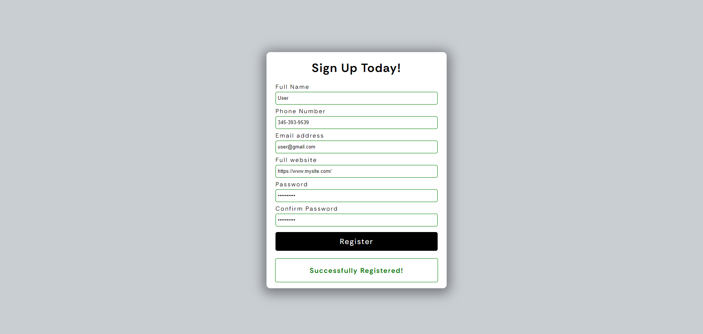
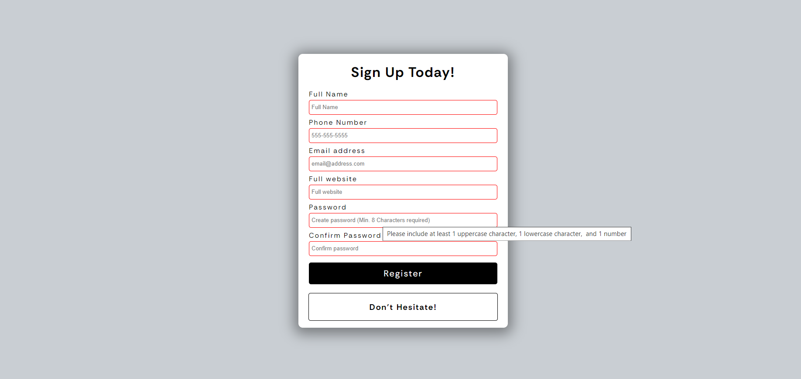

# Form Validation Project

A simple form validation project built with HTML, CSS, and JavaScript. This project validates user input for a sign-up form and provides feedback to the user accordingly.

## Live Demo

Check out the live demo [here](https://lambrugeorge.github.io/form-validator/).

## Screenshots

## Features

- Validates user input for a sign-up form including name, phone number, email, website, and password.
- Provides real-time feedback to the user about the validity of their input.
- Successfully registered users' data can be stored and accessed.

## Technologies Used

- HTML
- CSS
- JavaScript

## How to Use

1. Clone the repository.
2. Open the `index.html` file in your web browser.
3. Fill out the form and observe the validation feedback.

## Contributing

Contributions are welcome! Fork the repository and make your changes, then submit a pull request.
